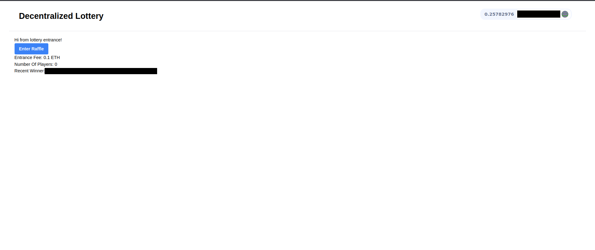

# Randomized Raffle

This project lets any user participate with a minimum amount of 0.1 eth in a lottery, in which the Chainlink VRF picks the user with the most luck and makes him the winner who grabs all the funds stacked into the smart contract.

## Setup

Install the packages using yarn both on the frontend and main folder, then run yarn hardhat node (use sudo in case it asks for root rights) to deploy your Rafle contract and your localhost version of VRF called VRFCoordinatorV2Mock. 

After go and connect to your JSON-RPC url shown at yarn hardhat node using metamask wallet (build a custom network and add the url there). Import one of the private keys shown on terminal and now you should be able to enter the raffle.

For the Goerli Testnet, get some geth from the https://faucets.chain.link/goerli and use as entrance fee.

To pick the winner use "yarn hardhat run scripts/mockOffchain.js" and then the contract will send the accumulated value back to the winner of the lottery.